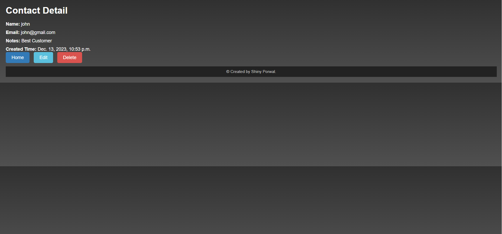

# Contact Mangement System by Shiny Porwal

## A Django web application that facilitates CRUD (Create, Read, Update, Delete) operations on a contact list. Users can create new contacts, view contact details, update contact information, and delete contacts.

---

## Features
- Create, read, update, and delete contacts.
- Unique constraints on name and email fields.
- Validations for email format.
- Responsive and user-friendly interface.
- Clear and intuitive navigation.

---

## Implementation Screenshots

  

    
<strong> Some screenshots of the Implementation</strong>

    
    
    
    
    
  

  
  

# Contributors

- Shiny Porwal
[(Back to top)](#contact-management-system-by-shiny-porwal)

